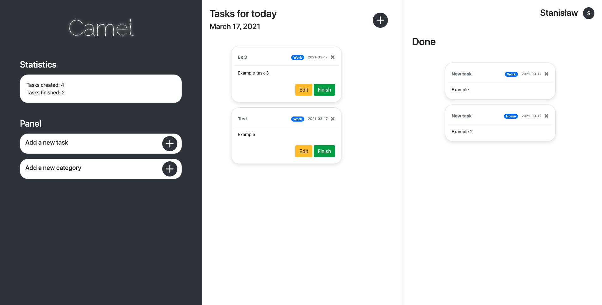

Task Manager / Flask Application

> # The aim of the project was to create simple task manager. It allowed me to improve my knowledge about Flask.

## Setup

### To run this project:

First of all make sure that you have Python version 3.6.6> installed on your machine.
Prepare virtual environment, for example with:

- pyenv (https://github.com/pyenv/pyenv-virtualenv)
- conda (https://docs.conda.io/projects/conda/en/latest/user-guide/concepts/environments.html)
- venv (https://packaging.python.org/guides/installing-using-pip-and-virtual-environments/)

After creating and running your virtual environment make sure that your 'pip' package installer is working. Check its version for a test and if needed update it:

```
$ pip --version
$ pip install --upgrade pip
```

Now time to install all the requirements and generate secret key (for example with python UUID):

Step 1:

    (your-venv) $ pip install -r requirements.txt

Step 2:

    (venv) $ python index.py

Step 3:
Generate your own secret key:

    app.secret_key = "SET A NEW KEY"

## About the App

It's a simple task manager with SQLite database (I may upgrade it to MySQL, but there is no need for that now. User can add new tasks to the board (Edit and Delete) and in case add it to "Done" list. I used Bootstrap4 for styling and Flask as a Web Framework. I have plans to develop more features in the future.

## Example screenshots




## Contact

Created by Stanislaw Polichnowski
